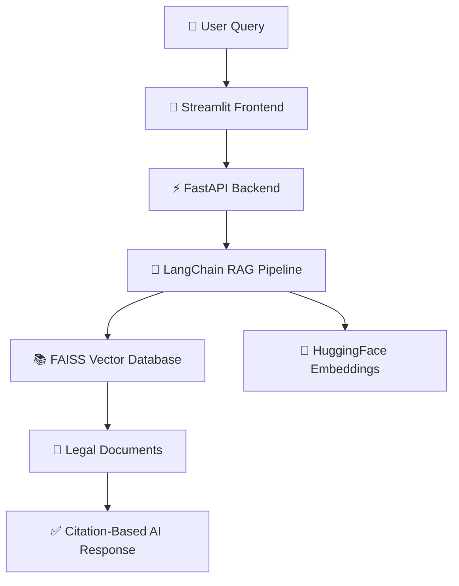

<!-- ========================================================= -->
<!-- 🚔 POLICE RULEBOOK ASSISTANT -->
<!-- ========================================================= -->

<div align="center">


# 👮 Police Rulebook Assistant
### ⚡ AI-Powered Public Safety Document Intelligence Platform

<p align="center">


</p>

<p align="center">


</p>

<br>

# 👨‍💻 Developed By

## **Barath R K PDKV**
### 🎓 Department of Cyber Security  
### 🆔 Reg No: 411623149004

<br>

<a href="https://police-rulebook-assistant.streamlit.app">
  
</a>

<a href="https://github.com/Barath-RK/police-rulebook-assistant-new">
  
</a>

</div>

---

# 🌟 Project Overview

**Police Rulebook Assistant** is a next-generation AI-powered legal document assistant developed for police departments and public safety organizations.

The system uses **Retrieval-Augmented Generation (RAG)** architecture to intelligently search, retrieve, and generate answers from legal and procedural documents.

This platform helps officers, administrators, and citizens quickly access important information from:

✅ Police SOP Manuals  
✅ IPC / CrPC Legal Documents  
✅ Complaint Filing Procedures  
✅ Citizen Support Documents  
✅ Investigation Guidelines  
✅ Public Safety Rulebooks  

The assistant delivers:

✔ Accurate AI-generated answers  
✔ Citation-backed legal responses  
✔ Semantic search capabilities  
✔ Fast document retrieval  
✔ Smart chatbot interaction  

---

# 🎯 Project Objectives

The primary objective of this project is to modernize legal document access using Artificial Intelligence.

### Key Goals

- 📚 Simplify police document search
- ⚡ Reduce manual searching time
- 🧠 Implement intelligent RAG workflows
- 🔍 Improve legal information accessibility
- 🤖 Build an AI-powered chatbot assistant
- 🛡️ Provide secure admin document management
- 🌐 Create a scalable public safety AI platform

---

# 🖼️ Application Preview

# 🏠 Main Dashboard

<p align="center">


</p>

<p align="center">
⚡ Smart Dashboard • AI Legal Search • Real-Time Assistance
</p>

---

# 📂 File Upload & Document Validation

<p align="center">
  

</p>

<p align="center">
📄 PDF Parsing • Knowledge Base Creation • AI Document Processing
</p>

---


# 💬 AI Chatbot Interface

<p align="center">


</p>

<p align="center">
🤖 Intelligent Q&A • Citation-Based Responses • Legal AI Assistant
</p>

---

# 🕘 Chat History Logging

<p align="center">


</p>

<p align="center">
📜 Conversation Tracking • User Query History • Session Management
</p>

---

# ⚡ Core Features

# 🧠 AI-Powered Legal Assistant

The chatbot uses advanced AI workflows to understand and process legal and procedural queries intelligently.

### Supported Queries

- ⚖️ IPC Sections
- 📘 Police Rules
- 📝 Complaint Filing Procedures
- 🚨 FIR Guidelines
- 📂 SOP Retrieval
- 👮 Investigation Procedures

---

# 📚 RAG-Based Document Retrieval

The platform uses a Retrieval-Augmented Generation pipeline for accurate information retrieval.

### Features

✅ Semantic Search  
✅ Citation-Based Answers  
✅ Context-Aware AI Responses  
✅ Fast Similarity Search  
✅ Vector Database Retrieval  

---

# 📄 Smart PDF Processing

The assistant automatically processes uploaded documents.

### Workflow

- PDF Upload
- Text Extraction
- Chunk Generation
- Embedding Creation
- Vector Storage
- AI Retrieval

---

# 🔐 Admin Knowledge Base Management

Admins can manage and refresh the legal knowledge base securely.

### Admin Functionalities

- Upload new documents
- Refresh vector database
- Manage knowledge sources
- Monitor chatbot responses
- Control access permissions

---

# 🕘 Chat History System

The platform stores user interactions for:

- Faster query understanding
- Better response quality
- Session tracking
- Conversation review

---

# ⚡ Semantic Search Engine

FAISS vector search enables high-speed similarity matching for legal documents.

### Benefits

- Faster legal retrieval
- Intelligent matching
- Accurate context understanding
- Improved answer relevance

---

# 🎨 UI/UX Highlights

✨ Modern Responsive Interface  
✨ Real-Time Chat Experience  
✨ Professional Dashboard Design  
✨ Clean Legal AI Interface  
✨ Fast User Interaction  
✨ Smooth Workflow Navigation  

---

# 🏗️ System Architecture



---

# 🛠️ Technology Stack

| Technology | Purpose |
|------------|----------|
| ⚡ FastAPI | Backend API Framework |
| 🎨 Streamlit | Frontend User Interface |
| 🧠 LangChain | RAG Workflow |
| 📚 FAISS | Vector Similarity Database |
| 🤗 HuggingFace | Embedding Generation |
| 🐍 Python | Core Development |
| 📄 PyPDFLoader | PDF Parsing |
| ☁️ Streamlit Cloud | Deployment |

---

# 📂 Project Structure

```bash
Police-Rulebook-Assistant/
│
├── backend/
│   ├── main.py
│   ├── rag_pipeline.py
│   ├── vector_store.py
│   └── requirements.txt
│
├── frontend/
│   ├── app.py
│   ├── components/
│   └── chatbot/
│
├── documents/
│   ├── ipc_manual.pdf
│   ├── sop_guidelines.pdf
│   └── citizen_procedures.pdf
│
├── screenshots/
├── chat_history/
├── LICENSE
├── README.md
└── requirements.txt
```

---

# ⚙️ Installation & Setup

# 1️⃣ Clone Repository

```bash
git clone https://github.com/Barath-RK/police-rulebook-assistant-new.git
```

---

# 2️⃣ Navigate to Project Folder

```bash
cd police-rulebook-assistant-new
```

---

# 3️⃣ Create Virtual Environment

```bash
python -m venv venv
```

---

# 4️⃣ Activate Virtual Environment

## Windows

```bash
venv\Scripts\activate
```

## Linux / macOS

```bash
source venv/bin/activate
```

---

# 5️⃣ Install Dependencies

```bash
pip install -r requirements.txt
```

---

# 6️⃣ Run Backend Server

```bash
uvicorn main:app --reload
```

---

# 7️⃣ Run Streamlit Frontend

```bash
streamlit run app.py
```

---

# 🚀 Deployment

The project is deployed using:

- ☁️ Streamlit Cloud
- ⚡ FastAPI Hosting
- 🌐 GitHub Repository Integration

---

# 🧪 Testing & Validation

The project includes complete validation workflows for:

✅ PDF Upload Testing  
✅ Document Parsing Validation  
✅ Semantic Search Accuracy  
✅ Citation Retrieval  
✅ Chatbot Response Validation  
✅ Admin Access Control  
✅ Knowledge Base Refresh  
✅ End-to-End Workflow Testing  

---

# 📋 Example AI Response

## 🔎 User Query

> What is the difference between Theft and Robbery under IPC?

---

## 🤖 AI Response

```txt
Theft (Section 378-379, IPC):
- Dishonest taking of movable property without consent
- No force or threat involved
- Punishment: Up to 3 years imprisonment or fine or both
- Bailable offence

Robbery (Section 390-392, IPC):
- Theft or extortion accompanied by force or threat
- Involves violence or fear
- Punishment: Rigorous imprisonment up to 10 years + fine
- Non-bailable offence

Key Difference:
Robbery includes force or threat, while theft does not.
```

---

# 📌 Future Enhancements

- 🤖 Advanced LLM Integration
- 🌍 Multi-Language Legal Support
- 🎙️ Voice-Based Legal Queries
- 📱 Mobile Application
- 🧠 Advanced AI Memory
- 📊 Analytics Dashboard
- 🔒 Enhanced Security Layer
- ☁️ Cloud Database Integration

---

# 📄 License

This project is licensed under the **MIT License**.

```txt
MIT License © 2026 Barath R K PDKV
```

---

# 🙌 Acknowledgements

Special thanks to:

- FastAPI Documentation
- LangChain Community
- Streamlit Team
- HuggingFace
- FAISS Research Team

---

# ⭐ Support

If you found this project useful:

⭐ Star the repository  
🍴 Fork the project  
📢 Share with others  
💡 Contribute improvements  

---

<div align="center">

# 🚔 THANK YOU FOR VISITING

### ⚡ Police Rulebook Assistant — Empowering Public Safety with AI


</div>
